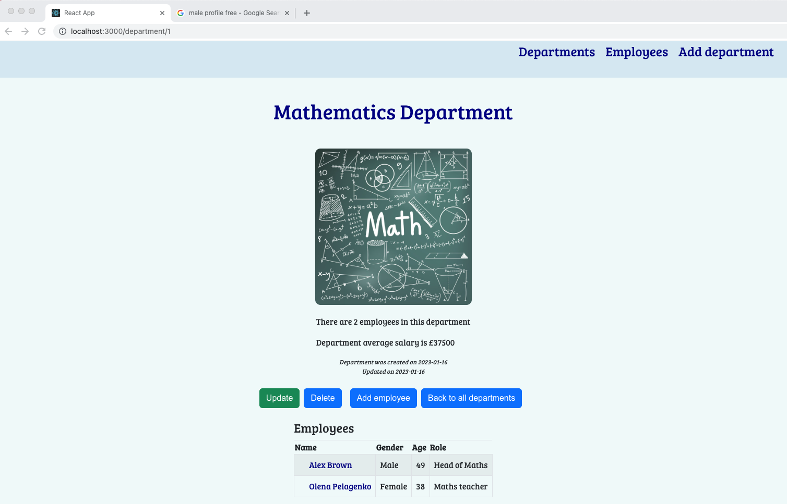

# School Departments

## Description

School Departments is a school employees and departments managing application, which displays a list of school departments, the number of employees and average salary for each of these departments. It displays a list of employees, searches employees born on a specific date or in the period between two given dates as well as adds, edits and deletes departments and employees

## Required software

- Docker
- Node.js

 ## To run the application

 From command line, clone and start the backend
 
```bash
 git clone git@github.com:ljenchik/school-departments-ts.git
 cd school-departments-ts/backend/database
 docker-compose up -d 
 npm install
 knex migrate:latest
 npm start
```

Open second terminal to start the frontend

```
cd my-mars-mission/frontend
npm install
npm start
```

## Usage

### Home Page

Home page of School Departments application displays a list of departments. Every department is highlighted while hovering and links to the page with the information about it.

<p float="left">


</p>

### Department Page

A user can update the department information: change name and/or logo. It also possible to delete department, but only if the department doesn't have emloyees, otherwise, an error message will be displayed.

<p float="left">


</p>

After adding employees the department page shows an average salary of department, number of employees and a list of all employees in a table.

<p float="left">

</p>

### Employee Page

Clicking on the name in the table allows to access the employee profile with a detailed information, which can be updated and/or deleted.

<p float="left">

</p>

### Employees Page

To access all employees the user has to click on the Employees link at the top. A table with a list of employees will be displayed as well as search options.

<p float="left">

</p>